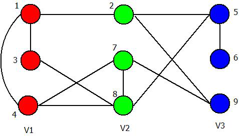
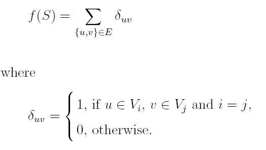

# Tabu-GCP
图着色问题的禁忌解法

图着色问题：给出一个图，要求为每个顶点着色。共有k种颜色，着色方案需满足：相邻顶点的颜色不可以相同。求最小k值。
图着色为典型的NP-HARD问题：k着色判定问题，即给定k值，求在有k个颜色时，是否可以使得相邻颜色不同。不断减小k值，逼近最小k值。

#### 初始化算法：DSATUR

在每次选择时分为两步：

第一步为选择需要着色的顶点：选择具有最少可用颜色的顶点，如有多个，则选择具有最多相邻未着色点的顶点。

第二步为选择所要涂的颜色：选择该顶点可用颜色中，可以提供给其他顶点的数量最少的颜色。

#### Local Search：

给定图G=(V;E),f值表示在图上的冲突数。将一次移动定义为(u,i,j),表示将点u从颜色i转变为颜色j。这次移动造成的冲突变化利用delta度量。

delta=ACTable[u][j]-ACTable[u][i]

移动后f=f-delta。Tabucol算法在每一步移动时，选择delta最小的移动方法，使得f减小最快。

Vertex|Red V1|Green V2|Blue V3
-|-|-|-
1|2|1|0
2|1|0|1
3|1|1|0
4|1|2|0
5|0|2|1
6|0|0|1
7|1|1|1
8|2|1|1
9|0|2|0

#### Tabucol算法：
Tabucol算法在Local Search的基础上，定义禁忌表的概念，即：在一定的迭代范围内访问的解决方案（称为禁忌任期）将不会被重新访问。

禁忌任期被定义为：tt=f+rand(10)+iter 

当一次移动(u,i,j)发生后，定义TabuTable[u][i]=tt；当检测一次移动(u,i,j)是否在禁忌表内时，检测 TabuTable[u][j]是否大于iter

特赦准则：如果存在某次在禁忌表中的移动同时满足：1.所得f比之前f都小；2.比此次可移动的非禁忌表内的操作所得的f都小。则可以使用在禁忌表内的操作。

#### 结果：
在500个点，6000多条边的图上可达到当前最优解。用时300s。
